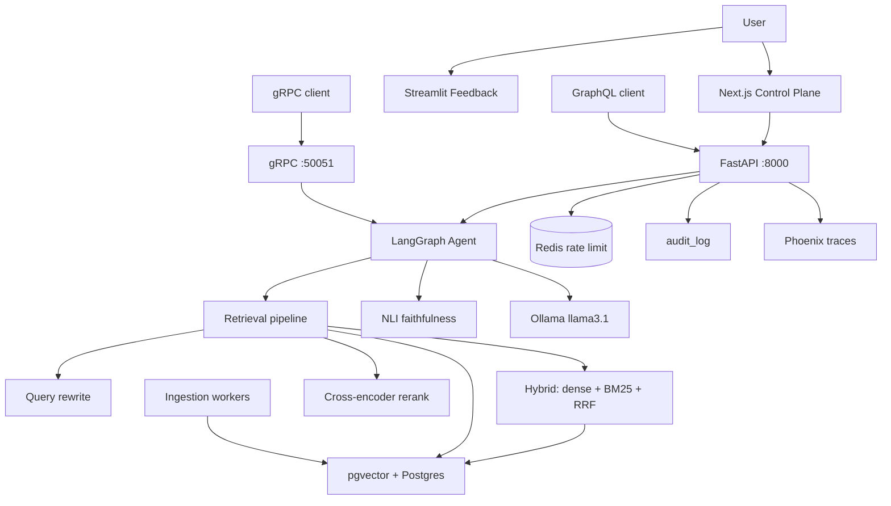
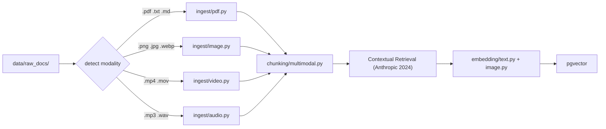
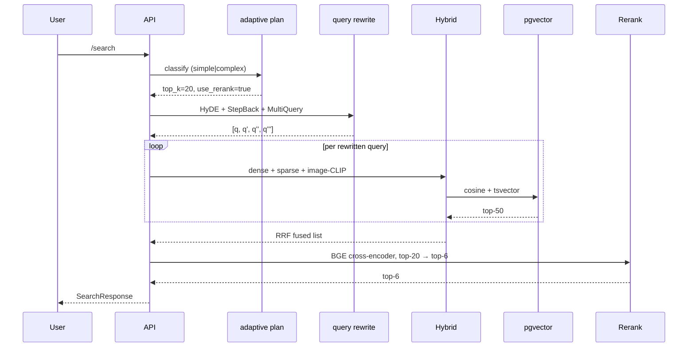
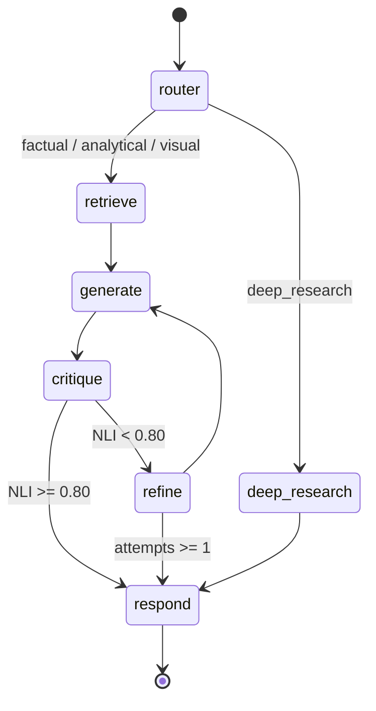
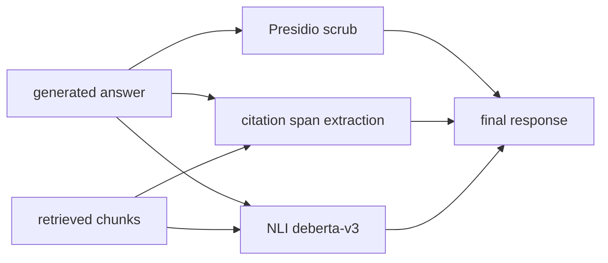
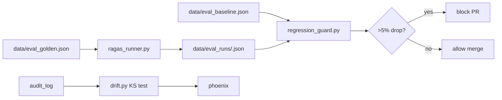

# Apex RAG — Architecture

This document walks through the system in layers, with mermaid diagrams and
links to the canonical source files. ADRs for each major decision live under
`docs/adr/`.

---

## 1. High-level overview

---

## 2. Ingestion

Each modality has its own loader. Loaders emit `Chunk` objects with
`Provenance` (source_uri, page, bbox, timestamp_start/end, speaker,
scene_index) — that provenance is what powers every UI feature later.

**Why Contextual Retrieval?** A one-sentence LLM-written context is prepended
to each chunk before embedding. Anthropic's 2024 ablation shows ~35% recall
improvement; we wire it as opt-in (`ENABLE_CONTEXTUAL_RETRIEVAL=true`) and
gracefully degrade if Ollama is unavailable.

---

## 3. Retrieval

**Key code:**
- [`src/apex/retrieval/pipeline.py`](../src/apex/retrieval/pipeline.py) — orchestrator
- [`src/apex/retrieval/hybrid.py`](../src/apex/retrieval/hybrid.py) — RRF fusion
- [`src/apex/retrieval/query_rewrite.py`](../src/apex/retrieval/query_rewrite.py) — HyDE/StepBack/MultiQuery
- [`src/apex/retrieval/rerank.py`](../src/apex/retrieval/rerank.py) — BGE cross-encoder
- [`src/apex/retrieval/adaptive.py`](../src/apex/retrieval/adaptive.py) — depth selection
- [`src/apex/retrieval/contextual.py`](../src/apex/retrieval/contextual.py) — ColBERT-style (experimental)

---

## 4. Agent

The router is a cheap heuristic + LLM-light classifier; it never blocks the
critical path. The `refine` loop runs at most once to bound latency.

**Key code:**
- [`src/apex/agent/graph.py`](../src/apex/agent/graph.py)
- [`src/apex/agent/router.py`](../src/apex/agent/router.py)
- [`src/apex/agent/deep_research.py`](../src/apex/agent/deep_research.py)
- [`src/apex/agent/tools.py`](../src/apex/agent/tools.py)
- [`src/apex/agent/prompts.py`](../src/apex/agent/prompts.py)

---

## 5. Safety + grounding

- **NLI faithfulness**: `cross-encoder/nli-deberta-v3-base` scores
  `answer_sentence → premise (retrieved chunk)`. We aggregate per-claim and
  the agent triggers a refine loop below the 0.80 threshold.
- **Citation grounding**: `difflib.SequenceMatcher` over tokenwise sequences
  finds the longest common span between the answer and each chunk → emit
  `(start_char, end_char, quote)` for inline UI highlighting.
- **PII**: Presidio analyzer + anonymizer at ingest **and** response-time;
  falls back to regex when Presidio isn't installed.

---

## 6. API surfaces

| Surface | Reach | When to use |
|---|---|---|
| **REST** (`/api/...`) | broad | UIs, integrations, simple curl |
| **SSE** (`/api/chat/stream`) | broad | streaming chat from any browser |
| **GraphQL** (`/graphql`) | typed | frontends that want flexible queries, federation |
| **gRPC** (`:50051`) | typed | internal services, bidi streaming, low overhead |

All three share one app process for REST + GraphQL; gRPC runs as a separate
worker so a slow tool call can't starve HTTP. See ADR 0005.

---

## 7. Multi-tenancy + hardening

- **Tenant resolution**: middleware (`X-Tenant-Id` header → JWT claim → default).
- **Rate limit**: per-tenant token bucket in Redis (falls back to in-memory).
- **Audit log**: every search/chat/upload/feedback is persisted to `audit_log`.
- **Degraded mode**: if Ollama is down, `/api/chat` returns chunks + highlights.
- **Request dedup**: identical concurrent (tenant, query) chats coalesce.
- **Backpressure**: bounded asyncio queue for ingestion → 429 + Retry-After.

---

## 8. Evaluation

- **RAGAS** metrics: faithfulness, context_recall, context_precision,
  answer_relevance, answer_correctness — computed via local Ollama judge.
- **Regression guard**: configurable per-metric threshold, defaults to 5 %.
- **Benchmark**: naive RAG vs Apex RAG side-by-side → `docs/benchmark.md`.
- **Drift**: KS test on the embedding distribution of recent queries vs the
  golden set; alert when `p_min < 0.05`.

---

## 9. Observability

- **Phoenix** at `localhost:6006` traces every retrieval and generation span.
- **loguru** for structured logs with `tenant_id`, `route`, `latency_ms`.
- **`/api/metrics`** exposes queue depth and circuit-breaker state.
- **Audit log SQL** (see runbook §8) for ad-hoc analysis.

---

## 10. Architecture decision records

- [ADR 0001 — pgvector vs Weaviate](adr/0001-pgvector-vs-weaviate.md)
- [ADR 0002 — Reciprocal Rank Fusion](adr/0002-rrf-fusion.md)
- [ADR 0003 — Cross-encoder reranker](adr/0003-cross-encoder-rerank.md)
- [ADR 0004 — LangGraph over LlamaIndex](adr/0004-langgraph-vs-llamaindex.md)
- [ADR 0005 — REST + gRPC + GraphQL coexistence](adr/0005-three-api-surfaces.md)
- [ADR 0006 — Local-only Ollama default](adr/0006-local-ollama-default.md)
