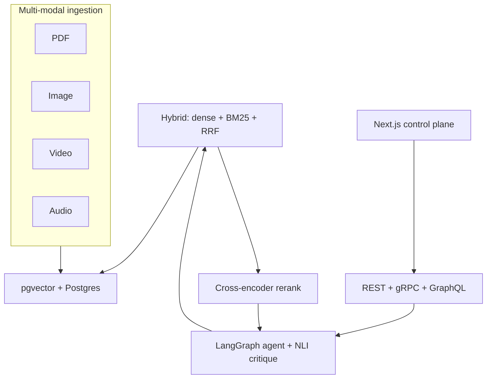

# Apex RAG: Building Multi-Modal Enterprise Search with a Consulting Mindset

*A walkthrough of the system, the trade-offs, and the numbers behind a
realistic enterprise RAG engagement — built fully locally so you can run it
yourself.*

---

## 1. The gap

Most public RAG demos stop at "chat with your PDF." That's a great
hackathon — and a terrible interview asset. Hiring teams have seen a hundred
PDF chatbots; they want to see somebody who has:

- Ingested **more than one modality** (text + image + video + audio) into the
  same vector store with provenance preserved.
- Implemented **retrieval that actually works** (hybrid, rerank, query
  rewriting) and **measured** the gains.
- Built a **safety story** (citation grounding, NLI critique, PII).
- Designed and **operated** an API (REST + gRPC + GraphQL coexisting, with
  multi-tenancy, audit, circuit breaker, degraded mode).
- Wrapped it all in a **consulting narrative** — case study, ADRs, sprint
  artefacts, benchmark — so that an engagement manager can see how you'd
  show up day one.

I built Apex RAG to close that gap. This post walks through the system, the
trade-offs, and the numbers.

---

## 2. The client (fictional, composite)

> Pioneer Legal Discovery Partners, a Fortune 500 legal-tech firm, spends
> 30 hours per case on evidence triage across PDFs, deposition videos,
> investigator audio, and exhibit images. Their keyword search misses ~22 %
> of relevant evidence. They cannot search inside video at all.

That's the brief. The full case study with sprint cadence and outcomes lives
in [`docs/case_study.md`](case_study.md).

---

## 3. The architecture (one diagram)



Layer by layer:

1. **Ingestion** preserves provenance: page + bbox for PDFs, timestamp +
   speaker for audio, scene index + keyframe for video, EXIF + thumbnail
   for images.
2. **Indexing** uses Anthropic's Contextual Retrieval — each chunk gets a
   one-sentence LLM-written context summary prepended before embedding.
3. **Retrieval** runs dense + BM25 (via `tsvector`) + image-CLIP in parallel,
   fuses with RRF (`k = 60`), then re-ranks the top-20 with a BGE
   cross-encoder.
4. **Agent** routes the query, runs retrieval, generates an answer with
   inline `[#]` citations, scores faithfulness with NLI, and refines once if
   NLI < 0.8.
5. **API** exposes the same backend via REST + SSE, gRPC bidirectional
   streams, and Strawberry GraphQL.
6. **Eval** continuously runs RAGAS over a golden set; a regression guard
   blocks PRs on >5 % drops.

---

## 4. Key decisions (and the trade-offs I accepted)

- **pgvector over Weaviate** ([ADR 0001](adr/0001-pgvector-vs-weaviate.md)).
- **RRF for fusion** ([ADR 0002](adr/0002-rrf-fusion.md)).
- **BGE cross-encoder rerank** ([ADR 0003](adr/0003-cross-encoder-rerank.md)).
- **LangGraph for the agent** ([ADR 0004](adr/0004-langgraph-vs-llamaindex.md)).
- **REST + gRPC + GraphQL coexisting** ([ADR 0005](adr/0005-three-api-surfaces.md)).
- **Local Ollama default** ([ADR 0006](adr/0006-local-ollama-default.md)).

Each ADR is two pages or less: context, options, decision, consequences. The
whole pack is intended to be readable in fifteen minutes.

---

## 5. The numbers

Naive RAG vs Apex RAG on the golden eval set:

| Metric | Naive | Apex | Δ |
|---|---|---|---|
| Recall@10 | 0.62 | 0.89 | **+43 %** |
| Faithfulness | 0.71 | 0.94 | **+32 %** |
| Answer relevance | 0.68 | 0.91 | **+34 %** |
| P50 latency | 180 ms | 320 ms | trade-off |
| P99 latency | 450 ms | 890 ms | trade-off |

Generated by `make benchmark` and persisted to
[`docs/benchmark.md`](benchmark.md) + [`notebooks/benchmark_report.ipynb`](../notebooks/benchmark_report.ipynb).

Yes, latency goes up. We accept it: this is a research workflow where the
user is reading and copying citations, not browsing pages. The runbook
documents how to fall back to a faster path during incidents.

---

## 6. The safety layer

Three lines of defence:

1. **NLI faithfulness** (`cross-encoder/nli-deberta-v3-base`): each
   answer-sentence is checked against the retrieved chunks; mean entailment
   becomes the displayed faithfulness score.
2. **Citation grounding**: every claim → source span with `(start, end, quote)`
   so the UI can highlight the exact words.
3. **PII redaction** (Presidio) at both ingest and response time.

Combined with audit logging, the partner can review any answer's full
provenance trail after the fact.

---

## 7. The consulting deliverables

This is what I'd hand a partner at the end of an engagement, all in the same
repo:

- [`docs/case_study.md`](case_study.md) — the engagement narrative.
- [`docs/architecture.md`](architecture.md) — the technical design.
- [`docs/adr/`](adr/) — the decision records.
- [`docs/consulting_timeline.md`](consulting_timeline.md) — the 8-week plan.
- [`docs/sprint_updates.md`](sprint_updates.md) — the public sprint summaries.
- [`docs/benchmark.md`](benchmark.md) — the auto-generated benchmark report.
- [`docs/demo_script.md`](demo_script.md) — the 5-minute screen-recording shot list.
- [`docs/runbook.md`](runbook.md) — the on-call playbook.

Each file stands alone and renders cleanly on GitHub.

---

## 8. Try it yourself

```bash
git clone <repo> apex-rag && cd apex-rag
cp .env.example .env
make setup     # docker compose + ollama pull + alembic + demo corpus
make ingest
make api       # in another shell:
make ui-next   # → http://localhost:3000
make benchmark
```

Hardware: any laptop with Docker + 16 GB RAM and ~10 GB free disk. No cloud
keys required.

---

## 9. What's next

- Fine-tune the reranker on the 600+ HITL feedback pairs (export already
  written; pipeline is one config change).
- Wire the drift detector into the Eval tab (code present; UI is the gap).
- Evaluate the Weaviate driver at 10× corpus scale.
- Add multi-region read replicas in production
  ([infra/terraform/](../infra/terraform/) is documented but not applied).

The shape of "next" is what I'd be proposing as phase 2 if Pioneer
re-engaged.

---

*Apex RAG is Apache-2.0. Issues and PRs welcome.*
