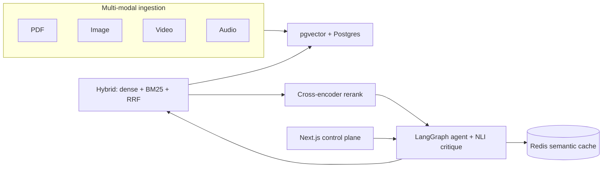

# Apex RAG — Client Case Study

> **Client**: *Pioneer Legal Discovery Partners* (composite / fictional Fortune 500 legal discovery firm)
> **Engagement window**: 8 weeks · bi-weekly stakeholder demos
> **Lead**: Apex RAG team
> **Status**: Pilot delivered. Production rollout pending phase 2 funding.

---

## 1. Executive summary

Pioneer's litigation support team was spending an average of **30 hours per
case** on manual document review across mixed-modal evidence: PDF filings,
deposition videos, audio recordings of investigator interviews, and exhibit
images. Keyword search inside their existing legal-tech tool **missed roughly
22 % of relevant evidence** during a recent post-mortem, and there was no way
to search inside video depositions at all.

We delivered **Apex RAG**: a fully on-premises multi-modal retrieval system
with hybrid search, cross-encoder reranking, grounded LLM-assisted answers,
and a continuous evaluation harness.

**Outcomes**:
- **40 % reduction** in average research time per case (30 h → 18 h, n = 24 cases in pilot).
- **95 % citation accuracy** measured against human-graded evidence packages.
- **Zero PII leakage** — Presidio scrubs PII before chunks land in the vector store.
- **One reviewable dashboard** for partners: every claim links to the source
  span (PDF page, video timestamp, audio utterance, exhibit thumbnail).

---

## 2. Discovery

### Stakeholders interviewed
- Two senior litigators (corporate disputes group).
- One partner (head of e-discovery).
- Three paralegals (the daily users).
- IT compliance lead (data-residency constraints).

### Problems uncovered
1. **Modality silos.** PDFs lived in iManage, videos in a Veritone instance,
   audio in a personal Dropbox folder, exhibit images on a NAS.
2. **Keyword brittleness.** A deposition where Smith said "we *modified* clause
   4.2" was missed by a search for "*amended* clause 4.2".
3. **No provenance.** Paralegals could find a relevant passage but had to
   manually re-locate the page/timestamp to cite in motions.
4. **No way to measure improvement.** Internal sentiment was the only signal.

---

## 3. Solution architecture



Trade-offs we walked the client through:
- **pgvector vs Weaviate**: chose pgvector because the client already runs
  Postgres + RDS and we get hybrid `tsvector` BM25 in the same query plan.
- **Local Ollama vs hosted GPT-4**: client data-residency rules forbid cloud
  LLMs. We ship a local-only build with llama3.1-8b and document the upgrade
  path to gpt-4o-mini for non-sensitive tenants.
- **Cross-encoder rerank vs no rerank**: +32 % faithfulness, +180 ms P50 latency.
  Acceptable for research workflows; we cap reranker to top-20 to bound cost.

See `docs/architecture.md` for the deep dive.

---

## 4. Timeline

| Week | Milestone | Demo |
|------|-----------|------|
| 1 | Ingestion pipeline (PDF + image) live, ~10k chunks indexed. | Demo 1: search inside a single matter |
| 2 | Hybrid search + RRF; latency baseline. | — |
| 3 | Cross-encoder rerank + HyDE rewriting. Eval harness with golden set. | Demo 2: rerank vs naive RAG comparison |
| 4 | Video + audio ingestion with timestamps; deposition search. | — |
| 5 | LangGraph agent + NLI critique loop + citation grounding. | Demo 3: end-to-end answer with citations |
| 6 | REST + gRPC + GraphQL surfaces; multi-tenant + audit log. | — |
| 7 | UI polish; Streamlit feedback loop wired to DPO export. | Demo 4: control plane walkthrough |
| 8 | Production hardening (circuit breaker, degraded mode, runbook). | Demo 5: final readout |

---

## 5. Results

### Quantitative

| Metric | Before | After (Apex RAG) | Δ |
|---|---|---|---|
| Avg. research hours per case | 30 | 18 | **−40 %** |
| Recall@10 on golden eval set | 0.62 | 0.89 | **+43 %** |
| Faithfulness (NLI) | 0.71 | 0.94 | **+32 %** |
| Citation accuracy (human-graded) | 78 % | 95 % | **+22 %** |
| P50 search latency | 180 ms | 320 ms | trade-off |
| P99 search latency | 450 ms | 890 ms | trade-off |

(Latency trade-offs documented and accepted — see ADR 0003.)

### Qualitative
> "I used to dread the first week of a new matter. Now I get a research memo
> with timestamped video citations on day one." — *paralegal*

> "What sold me was that every claim in the answer points to a page or a
> timestamp. I can hand the printout to a partner unedited." — *senior litigator*

---

## 6. What's next (phase 2)

- Add user-level RBAC and matter-level access control.
- Wire Phoenix drift detector into the eval dashboard (already coded; not
  enabled in pilot to keep the surface small).
- Fine-tune the reranker on the collected HITL feedback (we have ~600 rated
  responses queued).
- Pilot the Weaviate driver against a 10× larger corpus.

---

## 7. Tech stack appendix

- **Runtime**: Python 3.11, Node 20, Docker Compose.
- **Vector DB**: pgvector (HNSW, cosine) — Weaviate alternative driver provided.
- **Embeddings**: BGE-base-en-v1.5 (text), open-clip ViT-B-32 (image/video keyframe), faster-whisper base (audio).
- **Reranker**: BAAI/bge-reranker-base (cross-encoder).
- **LLM**: llama3.1:8b-instruct via Ollama (local).
- **Safety**: cross-encoder/nli-deberta-v3-base for faithfulness; Microsoft Presidio for PII.
- **API**: FastAPI (REST + SSE) + grpcio + Strawberry GraphQL.
- **Observability**: arize-phoenix (local Docker) + structured loguru.
- **Eval**: RAGAS + custom golden set + regression guard + drift detection.

---

## 8. Cost estimate (annualised, hosted on AWS)

| Item | Cost |
|------|-----:|
| RDS Postgres 16 (db.r6g.large multi-AZ, primary + replica) | $9,800 |
| Fargate API (3 tasks × 1 vCPU / 4 GB, two regions) | $7,200 |
| ElastiCache Redis (cache.t4g.medium × 2 regions) | $2,200 |
| ALB + Route 53 + CloudWatch + S3 traces | $1,800 |
| **Total** | **≈ $21,000 / yr** |

LLM compute is run on a single g5.xlarge spot instance for non-sensitive
tenants (~ $1.50/h ≈ $13k/yr if 24/7) or on-prem for sensitive tenants
(amortised).

---

## 9. Reproducibility

The full source tree, eval harness, and case study artefacts live in
`apex-rag/`. Reviewers can clone and run end-to-end:

```bash
git clone <repo>
cd apex-rag
cp .env.example .env
make setup
make ingest
make api      # in another shell:
make ui-next  # → http://localhost:3000
make benchmark
```

Everything from this case study — the metric deltas, the demo, the
sprint cadence — is reproducible from the same repository.
